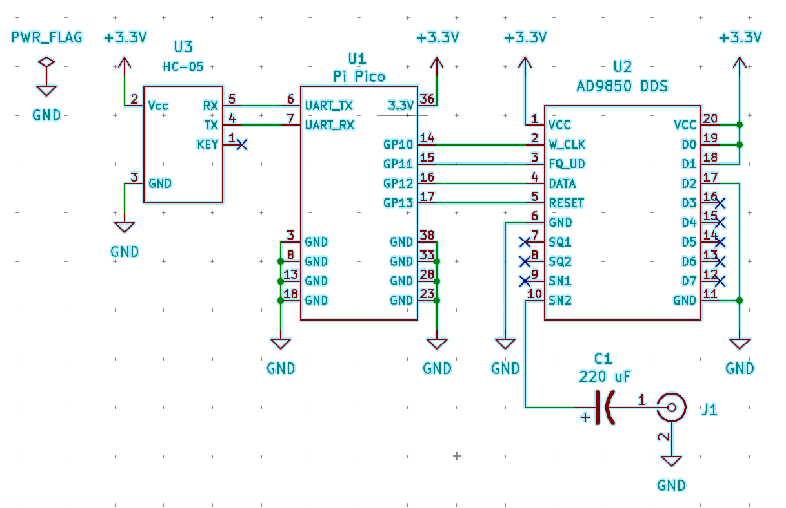
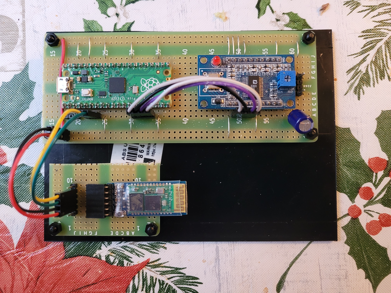

# raspberrypipico-siggen

This repo contains the source code for a signal generator based on one
of the AD9850 DDS modules, controlled by a Raspberry Pi Pico.  It can 
be controlled via a USB serial connection or Bluetooth.

## Circuit Schematic

The circuit used is shown below and is, by no means, original.

<div align="center">

</div>

It's powered from the USB connection with the Bluetooth connection 
supplied by an HC-05 Bluetooth module.  The prototype was built on 
strip board and is shown in the photo below.

<div align="center">

</div>

## Controlling the Signal Generator

The signal generator is controlled via json interfact that was implemented
using Rafa Garcia's [tiny json](https://github.com/rafagafe/tiny-json/tree/master) 
library.  

The JSON schema is given below, along with field definitions.

```
{
    "command_number": <value>,
    "frequency_hz": <value_in_hz>,
    "phase_deg": <value_in_deg>,
    "enable_out": <true_or_false>
}
```

| Field Name       | Description
|------------------|------------------------------------------------
| command_number   | Required numeric field used to identify and acknowledge the command.
| frequency        | Optional field used to set the desired DDS frequency, in Hz.
| phase            | Optional field used to set the desired DDS phase, in increments of .01 deg.
| enable_out       | Optional field that, when set to 'true' enables the DDS output, 'false' disables it.

The JSON can be sent from a script or even built by hand and sent from
a serial terminal.  When a command is sent the signal generator will 
echo it and respond with a JSON string containing the command number 
and current frequency, phase, and DDS output status.  If the JSON 
command cannot be parsed for some reason, the response will contain 
the command_number and an error string.  An example is shown in the 
image below.

<div align="center">

</div>

## Using the Signal Generator

The HC-05 module is not required but the Bluetooth functionality is 
included in the signal generator source by default.  To remove it and 
use the circuit via the USB serial port, open the `pico-siggen.cpp` 
file and locate the block where the UART constants are defined. 
Change the uart variable to contain the value `nullopt`so the block 
looks like:

```
    // These are the TX and RX pins for UART1
    //
    std::optional<uart_inst_t*> uart = nullopt;
    const uint UART_TX = 4;
    const uint UART_RX = 5;
    const uint BAUD    = 9600;
```

In either case, just build the C/C++ source and load it into the Pi 
Pico as normal.  

In the repo there are two Python scripts used to control the signal
generator.  The first, named `siggen`, is used in the case where you're
controlling the signal generator via the USB serial connection and can 
be executed using the command

```
    ./siggen <command> <option>
```

Available subcommands are:

| Command                           | Description
|-----------------------------------|-------------------------------------
| set_frequency <frequency_in_hz>   | Set the DDS frequency, in Hz
| get_frequency                     | Display the current frequency, in Hz
| set_phase <phase_in_deg>          | Set the DDS phase, in deg
| get_phase                         | Display the current phase, in deg
| enable_out                        | Enable the DDS output
| disable_out                       | Disable the DDS output
| get_state                         | Display the current signal generator state
| help                              | Display available commands

The second, named `siggen_bt`, is used in the case where you're 
controlling the signal generator via Bluetooth.  First pair the HC-05
module with your controlling system and get the Bluetooth address.  Then
the script can be executed using the command

```
    ./siggen_bt <bt_address> <command> <option>
```

The available subcommands are the same as for the `siggen` script except
`bt_address` is the Bluetooth device address.  If you substitute `scan`
for the Bluetooth address the script will scan for available Bluetooth
devices.  For example, on my machine, the sequence to send a command to
the signal generator looks like

```
    ./siggen_bt scan
    Scanning for blueetooth devices...
    01:23:45:67:89:AB - HC-05

    ./siggen_bt 01:23:45:67:89:AB enable_out
    OK
```

The signal generator defaults to a frequency of 1 kHz with the output 
disabled on startup.  The USB serial connection uses the default port of 
`/dev/ttyACM0`.  If your port is different you'll have to change 
it in the script.  To use the Bluetooth connection you'll have to pair
your controlling system with the HC-05 module, as mentioned previously.

## License

With the exception of the siggen_bt python script, this project uses
the MIT License.  The siggen_bt python script uses the pybluez2 module
and, as such, is licensed under the GPL V2.
